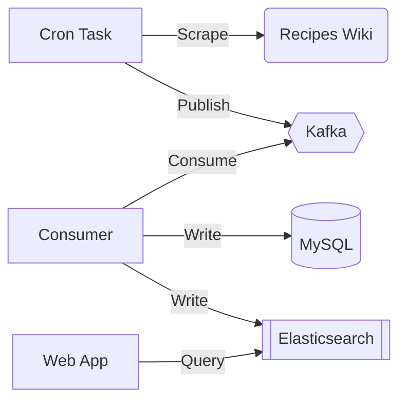

# Enough Recipes!

For the last year or two, recipe search has taken over TODO lists as
the go-to example website.

Funny part about that, of course, is that most of these sites aren't
bootstrapped with a decent number of recipes.

We used to be able to just pull recipes from the
[Recipe Wiki's](https://recipes.fandom.com) Wikia API.
Fandom has removed that capability, but fortunately
they still have some core MediaWiki APIs for listing
pages, and you can still scrape their pages.

So this is a quick and dirty recipe app to kick the tires on
a variety of Vultr's tooling, including:

- [Vultr Terraform Provider + Modules](https://registry.terraform.io/providers/vultr/vultr/latest/docs)
- [MySQL DBaaS](https://www.vultr.com/products/managed-databases/)
- [VKE](https://www.vultr.com/kubernetes/)
- [Load Balancer](https://www.vultr.com/products/load-balancers/) (As a VKE Service)
- [Vultr Block Storage](https://www.vultr.com/products/block-storage/) (Backing VKE resources)
- [Vultr Object Storage](https://www.vultr.com/products/object-storage/) (For static assets)

This is a Django app with many things operationalized into a `Makefile`.

Kubernetes configs are in the `k8s` folder. Resources you can roll out locally
live in `base`, while the Vultr-specific resources are in `vultr`.

Please note that `k8s/helm` provides scripts for bootstrapping helm charts
with the appropriate configurations to integrate properly with Vultr's
block storage storage class. Another way to handle this would be to
deploy the helm charts with
[Terraform](https://registry.terraform.io/providers/hashicorp/helm/latest/docs).

We use Helm for both Kafka and Elasticsearch resources, with the arguments required
to define the appropriate storage class to use Vultr's block storage functionality.

## How Does It Work?

A daily cron task registered with Kubernetes runs a job
that hits the Recipe Wiki's MediaWiki API, and uses that data
to scrape the parsed HTML, storing it in both our MySQL database
as well as the Elasticsearch cluster managed by Helm.
